# BookVerse Platform - Helm Charts Guide

## Chart structure, value configuration patterns, and template customization for Kubernetes deployment automation

The BookVerse Platform provides comprehensive Helm charts that automate Kubernetes deployment across all microservices with sophisticated configuration management, environment-specific customization, and production-ready deployment patterns integrated with GitOps workflows.

---

## 📋 Table of Contents

- [Helm Chart Architecture](#️-helm-chart-architecture)
- [Chart Structure Overview](#-chart-structure-overview)
- [Configuration Management](#️-configuration-management)
- [Template Customization](#-template-customization)
- [Environment-Specific Deployments](#-environment-specific-deployments)
- [Service Dependencies](#-service-dependencies)
- [Security and RBAC](#-security-and-rbac)
- [Monitoring Integration](#-monitoring-integration)
- [GitOps Integration](#-gitops-integration)
- [Troubleshooting Guide](#-troubleshooting-guide)

---

## 🏗️ Helm Chart Architecture

### Chart Hierarchy Overview

The BookVerse Helm charts follow a hierarchical structure with umbrella charts and service-specific subcharts:

```mermaid
graph TB
    UC[📦 BookVerse Umbrella Chart<br/>Platform-wide deployment<br/>Environment configuration<br/>Service coordination] --> IS[📋 Inventory Service Chart<br/>Product catalog deployment<br/>Database configuration<br/>API endpoints]
    
    UC --> RS[🤖 Recommendations Service Chart<br/>ML service deployment<br/>Worker configuration<br/>Cache management]
    
    UC --> CS[💳 Checkout Service Chart<br/>Order processing deployment<br/>Payment integration<br/>Transaction management]
    
    UC --> WS[🌐 Web Service Chart<br/>Frontend deployment<br/>Static assets<br/>CDN configuration]
    
    UC --> PS[🎯 Platform Service Chart<br/>Orchestration deployment<br/>Aggregation services<br/>Release management]
    
    UC --> IS2[🔧 Infrastructure Components<br/>Shared services<br/>Monitoring stack<br/>Security components]
    
    IS --> DB1[(SQLite/PostgreSQL<br/>Inventory database)]
    RS --> CACHE[(Redis<br/>Recommendations cache)]
    CS --> DB2[(SQLite/PostgreSQL<br/>Checkout database)]
    
    UC --> NS[📁 Namespace Management<br/>Environment isolation<br/>Resource quotas<br/>Network policies]
```



### Chart Dependencies

```yaml
# Chart.yaml - BookVerse Umbrella Chart
apiVersion: v2
name: bookverse-platform
description: Complete BookVerse microservices platform deployment
type: application
version: 1.0.0
appVersion: "2.1.0"

dependencies:
  # Core Services
  - name: bookverse-inventory
    version: "1.2.3"
    repository: "file://charts/inventory"
    condition: inventory.enabled
    
  - name: bookverse-recommendations
    version: "2.1.0"
    repository: "file://charts/recommendations"
    condition: recommendations.enabled
    
  - name: bookverse-checkout
    version: "1.5.2"
    repository: "file://charts/checkout"
    condition: checkout.enabled
    
  - name: bookverse-web
    version: "3.0.1"
    repository: "file://charts/web"
    condition: web.enabled
    
  - name: bookverse-platform
    version: "1.1.0"
    repository: "file://charts/platform"
    condition: platform.enabled
    
  # Infrastructure Dependencies
  - name: redis
    version: "17.15.6"
    repository: "https://charts.bitnami.com/bitnami"
    condition: redis.enabled
    
  - name: postgresql
    version: "12.12.10"
    repository: "https://charts.bitnami.com/bitnami"
    condition: postgresql.enabled
    
  # Monitoring Stack
  - name: prometheus
    version: "25.6.0"
    repository: "https://prometheus-community.github.io/helm-charts"
    condition: monitoring.prometheus.enabled
    
  - name: grafana
    version: "7.0.8"
    repository: "https://grafana.github.io/helm-charts"
    condition: monitoring.grafana.enabled

maintainers:
  - name: BookVerse Platform Team
    email: platform@bookverse.com
    url: https://github.com/bookverse/platform

keywords:
  - microservices
  - e-commerce
  - kubernetes
  - helm
  - bookverse
```

---

## 📁 Chart Structure Overview

### Standard Chart Layout

Each BookVerse service follows a standardized Helm chart structure:

```text
charts/inventory/
├── Chart.yaml                    # Chart metadata and dependencies
├── values.yaml                   # Default configuration values
├── values-dev.yaml               # Development environment overrides
├── values-qa.yaml                # QA environment overrides
├── values-staging.yaml           # Staging environment overrides
├── values-prod.yaml              # Production environment overrides
├── templates/                    # Kubernetes resource templates
│   ├── deployment.yaml           # Main service deployment
│   ├── service.yaml              # Service exposure configuration
│   ├── ingress.yaml              # Ingress routing rules
│   ├── configmap.yaml            # Configuration management
│   ├── secret.yaml               # Secret management
│   ├── hpa.yaml                  # Horizontal Pod Autoscaler
│   ├── pdb.yaml                  # Pod Disruption Budget
│   ├── networkpolicy.yaml        # Network security policies
│   ├── rbac.yaml                 # Role-Based Access Control
│   ├── servicemonitor.yaml       # Prometheus monitoring
│   └── _helpers.tpl              # Template helper functions
├── charts/                       # Subchart dependencies
├── crds/                         # Custom Resource Definitions
└── tests/                        # Helm test files
    ├── test-connection.yaml       # Connectivity tests
    ├── test-api.yaml             # API functionality tests
    └── test-integration.yaml     # Integration tests
```

### Helper Template Functions

```yaml
# templates/_helpers.tpl - Reusable template functions
{{/*
Expand the name of the chart.
*/}}
{{- define "bookverse-inventory.name" -}}
{{- default .Chart.Name .Values.nameOverride | trunc 63 | trimSuffix "-" }}
{{- end }}

{{/*
Create a default fully qualified app name.
*/}}
{{- define "bookverse-inventory.fullname" -}}
{{- if .Values.fullnameOverride }}
{{- .Values.fullnameOverride | trunc 63 | trimSuffix "-" }}
{{- else }}
{{- $name := default .Chart.Name .Values.nameOverride }}
{{- if contains $name .Release.Name }}
{{- .Release.Name | trunc 63 | trimSuffix "-" }}
{{- else }}
{{- printf "%s-%s" .Release.Name $name | trunc 63 | trimSuffix "-" }}
{{- end }}
{{- end }}
{{- end }}

{{/*
Create chart name and version as used by the chart label.
*/}}
{{- define "bookverse-inventory.chart" -}}
{{- printf "%s-%s" .Chart.Name .Chart.Version | replace "+" "_" | trunc 63 | trimSuffix "-" }}
{{- end }}

{{/*
Common labels
*/}}
{{- define "bookverse-inventory.labels" -}}
helm.sh/chart: {{ include "bookverse-inventory.chart" . }}
{{ include "bookverse-inventory.selectorLabels" . }}
{{- if .Chart.AppVersion }}
app.kubernetes.io/version: {{ .Chart.AppVersion | quote }}
{{- end }}
app.kubernetes.io/managed-by: {{ .Release.Service }}
app.kubernetes.io/part-of: bookverse-platform
{{- end }}

{{/*
Selector labels
*/}}
{{- define "bookverse-inventory.selectorLabels" -}}
app.kubernetes.io/name: {{ include "bookverse-inventory.name" . }}
app.kubernetes.io/instance: {{ .Release.Name }}
{{- end }}

{{/*
Create the name of the service account to use
*/}}
{{- define "bookverse-inventory.serviceAccountName" -}}
{{- if .Values.serviceAccount.create }}
{{- default (include "bookverse-inventory.fullname" .) .Values.serviceAccount.name }}
{{- else }}
{{- default "default" .Values.serviceAccount.name }}
{{- end }}
{{- end }}

{{/*
Database connection string
*/}}
{{- define "bookverse-inventory.databaseUrl" -}}
{{- if .Values.database.external.enabled }}
{{- printf "postgresql://%s:%s@%s:%d/%s" .Values.database.external.username .Values.database.external.password .Values.database.external.host (.Values.database.external.port | int) .Values.database.external.database }}
{{- else }}
{{- printf "postgresql://inventory:password@%s-postgresql:5432/inventory" .Release.Name }}
{{- end }}
{{- end }}

{{/*
Image repository and tag
*/}}
{{- define "bookverse-inventory.image" -}}
{{- $registry := .Values.image.registry | default .Values.global.imageRegistry }}
{{- $repository := .Values.image.repository }}
{{- $tag := .Values.image.tag | default .Chart.AppVersion }}
{{- if $registry }}
{{- printf "%s/%s:%s" $registry $repository $tag }}
{{- else }}
{{- printf "%s:%s" $repository $tag }}
{{- end }}
{{- end }}
```

---

## ⚙️ Configuration Management

### Default Values Structure

```yaml
# values.yaml - Comprehensive configuration template
global:
  # Global configuration shared across all services
  imageRegistry: "swampupsec.jfrog.io"
  imagePullSecrets: 
    - name: jfrog-credentials
  storageClass: "fast-ssd"
  
  # Environment configuration
  environment: "production"
  domain: "bookverse.com"
  
  # Security configuration
  podSecurityPolicy:
    enabled: true
  networkPolicy:
    enabled: true
    
  # Monitoring configuration
  monitoring:
    enabled: true
    namespace: "monitoring"

# Service-specific configuration
replicaCount: 3

image:
  registry: ""  # Uses global.imageRegistry if not specified
  repository: "bookverse/inventory"
  tag: ""  # Uses Chart.AppVersion if not specified
  pullPolicy: IfNotPresent

nameOverride: ""
fullnameOverride: ""

# Service account configuration
serviceAccount:
  create: true
  annotations: {}
  name: ""
  automountServiceAccountToken: true

# Pod security context
podSecurityContext:
  runAsNonRoot: true
  runAsUser: 1000
  runAsGroup: 3000
  fsGroup: 2000
  seccompProfile:
    type: RuntimeDefault

# Container security context
securityContext:
  allowPrivilegeEscalation: false
  capabilities:
    drop:
    - ALL
  readOnlyRootFilesystem: true
  runAsNonRoot: true
  runAsUser: 1000

# Service configuration
service:
  type: ClusterIP
  port: 80
  targetPort: 8000
  annotations:
    # Service mesh annotations
    consul.hashicorp.com/connect-inject: "true"
    # Monitoring annotations
    prometheus.io/scrape: "true"
    prometheus.io/port: "8000"
    prometheus.io/path: "/metrics"

# Ingress configuration
ingress:
  enabled: true
  className: "traefik"
  annotations:
    traefik.ingress.kubernetes.io/router.middlewares: "security-headers@kubernetescrd"
    traefik.ingress.kubernetes.io/router.tls: "true"
    cert-manager.io/cluster-issuer: "letsencrypt-prod"
  hosts:
    - host: inventory.bookverse.com
      paths:
        - path: /
          pathType: Prefix
  tls:
    - secretName: inventory-tls
      hosts:
        - inventory.bookverse.com

# Resource configuration
resources:
  limits:
    cpu: 1000m
    memory: 1Gi
  requests:
    cpu: 500m
    memory: 512Mi

# Horizontal Pod Autoscaling
autoscaling:
  enabled: true
  minReplicas: 2
  maxReplicas: 10
  targetCPUUtilizationPercentage: 70
  targetMemoryUtilizationPercentage: 80
  behavior:
    scaleDown:
      stabilizationWindowSeconds: 300
      policies:
      - type: Percent
        value: 50
        periodSeconds: 60
    scaleUp:
      stabilizationWindowSeconds: 60
      policies:
      - type: Percent
        value: 100
        periodSeconds: 60

# Pod Disruption Budget
podDisruptionBudget:
  enabled: true
  minAvailable: 1
  # maxUnavailable: 25%

# Node selection and affinity
nodeSelector: {}

tolerations: []

affinity:
  podAntiAffinity:
    preferredDuringSchedulingIgnoredDuringExecution:
    - weight: 100
      podAffinityTerm:
        labelSelector:
          matchExpressions:
          - key: app.kubernetes.io/name
            operator: In
            values:
            - bookverse-inventory
        topologyKey: kubernetes.io/hostname

# Database configuration
database:
  # Use external database
  external:
    enabled: false
    host: ""
    port: 5432
    database: "inventory"
    username: "inventory"
    password: ""
    sslMode: "require"
  
  # Use embedded PostgreSQL subchart
  postgresql:
    enabled: true
    auth:
      postgresPassword: "password"
      username: "inventory"
      password: "password"
      database: "inventory"
    primary:
      persistence:
        enabled: true
        size: 10Gi
        storageClass: "fast-ssd"

# Redis configuration for caching
redis:
  enabled: true
  auth:
    enabled: true
    password: "redis-password"
  master:
    persistence:
      enabled: true
      size: 5Gi

# Application configuration
app:
  config:
    # Environment variables
    environment: "production"
    logLevel: "INFO"
    authEnabled: true
    metricsEnabled: true
    
    # Feature flags
    features:
      recommendationsEnabled: true
      inventoryTrackingEnabled: true
      realTimeUpdatesEnabled: true
    
    # External service URLs
    externalServices:
      recommendationsUrl: "http://bookverse-recommendations:80"
      checkoutUrl: "http://bookverse-checkout:80"
      platformUrl: "http://bookverse-platform:80"

# Health check configuration
healthCheck:
  enabled: true
  livenessProbe:
    httpGet:
      path: /health
      port: http
    initialDelaySeconds: 30
    periodSeconds: 10
    timeoutSeconds: 5
    successThreshold: 1
    failureThreshold: 3
  readinessProbe:
    httpGet:
      path: /ready
      port: http
    initialDelaySeconds: 5
    periodSeconds: 5
    timeoutSeconds: 3
    successThreshold: 1
    failureThreshold: 3

# Monitoring configuration
monitoring:
  serviceMonitor:
    enabled: true
    interval: 30s
    path: /metrics
    labels:
      team: platform
      service: inventory
  
  # Grafana dashboard
  dashboard:
    enabled: true
    annotations:
      grafana_folder: "BookVerse Services"

# Network policies
networkPolicy:
  enabled: true
  ingress:
    - from:
      - namespaceSelector:
          matchLabels:
            name: bookverse-web
      - namespaceSelector:
          matchLabels:
            name: bookverse-checkout
      - namespaceSelector:
          matchLabels:
            name: bookverse-recommendations
      ports:
      - protocol: TCP
        port: 8000
  egress:
    - to:
      - namespaceSelector:
          matchLabels:
            name: bookverse-database
      ports:
      - protocol: TCP
        port: 5432

# Backup configuration
backup:
  enabled: true
  schedule: "0 2 * * *"  # Daily at 2 AM
  retention: "30d"
  storage:
    size: "50Gi"
    storageClass: "backup-storage"
```

### Environment-Specific Overrides

```yaml
# values-prod.yaml - Production environment overrides
global:
  environment: "production"
  domain: "bookverse.com"

replicaCount: 5

image:
  tag: "1.2.3"
  pullPolicy: Always

resources:
  limits:
    cpu: 2000m
    memory: 4Gi
  requests:
    cpu: 1000m
    memory: 2Gi

autoscaling:
  enabled: true
  minReplicas: 5
  maxReplicas: 20
  targetCPUUtilizationPercentage: 60
  targetMemoryUtilizationPercentage: 70

database:
  external:
    enabled: true
    host: "production-postgres.example.com"
    port: 5432
    database: "bookverse_inventory"
    username: "inventory_prod"
    sslMode: "require"
  postgresql:
    enabled: false

app:
  config:
    logLevel: "WARN"
    environment: "production"

ingress:
  annotations:
    traefik.ingress.kubernetes.io/router.middlewares: "security-headers@kubernetescrd,rate-limit@kubernetescrd"
    nginx.ingress.kubernetes.io/rate-limit: "1000"
  hosts:
    - host: api.bookverse.com
      paths:
        - path: /inventory
          pathType: Prefix

monitoring:
  serviceMonitor:
    interval: 15s
    labels:
      environment: production
      criticality: high
```

```yaml
# values-dev.yaml - Development environment overrides
global:
  environment: "development"
  domain: "dev.bookverse.local"

replicaCount: 1

image:
  tag: "latest"
  pullPolicy: Always

resources:
  limits:
    cpu: 500m
    memory: 512Mi
  requests:
    cpu: 100m
    memory: 128Mi

autoscaling:
  enabled: false

database:
  postgresql:
    enabled: true
    auth:
      postgresPassword: "dev-password"
      username: "dev"
      password: "dev-password"
      database: "inventory_dev"
    primary:
      persistence:
        enabled: false  # Use emptyDir for development

app:
  config:
    logLevel: "DEBUG"
    environment: "development"
    authEnabled: false

ingress:
  enabled: false

monitoring:
  serviceMonitor:
    enabled: false
```

---

## 🎨 Template Customization

### Deployment Template

```yaml
# templates/deployment.yaml - Service deployment configuration
apiVersion: apps/v1
kind: Deployment
metadata:
  name: {{ include "bookverse-inventory.fullname" . }}
  labels:
    {{- include "bookverse-inventory.labels" . | nindent 4 }}
  annotations:
    deployment.kubernetes.io/revision: "{{ .Values.image.tag | default .Chart.AppVersion }}"
    config.kubernetes.io/checksum: {{ include (print $.Template.BasePath "/configmap.yaml") . | sha256sum }}
spec:
  {{- if not .Values.autoscaling.enabled }}
  replicas: {{ .Values.replicaCount }}
  {{- end }}
  selector:
    matchLabels:
      {{- include "bookverse-inventory.selectorLabels" . | nindent 6 }}
  template:
    metadata:
      annotations:
        checksum/config: {{ include (print $.Template.BasePath "/configmap.yaml") . | sha256sum }}
        checksum/secret: {{ include (print $.Template.BasePath "/secret.yaml") . | sha256sum }}
        {{- with .Values.podAnnotations }}
        {{- toYaml . | nindent 8 }}
        {{- end }}
      labels:
        {{- include "bookverse-inventory.selectorLabels" . | nindent 8 }}
        version: "{{ .Values.image.tag | default .Chart.AppVersion }}"
    spec:
      {{- with .Values.global.imagePullSecrets }}
      imagePullSecrets:
        {{- toYaml . | nindent 8 }}
      {{- end }}
      serviceAccountName: {{ include "bookverse-inventory.serviceAccountName" . }}
      securityContext:
        {{- toYaml .Values.podSecurityContext | nindent 8 }}
      containers:
        - name: {{ .Chart.Name }}
          securityContext:
            {{- toYaml .Values.securityContext | nindent 12 }}
          image: {{ include "bookverse-inventory.image" . }}
          imagePullPolicy: {{ .Values.image.pullPolicy }}
          ports:
            - name: http
              containerPort: 8000
              protocol: TCP
            - name: metrics
              containerPort: 8001
              protocol: TCP
          env:
            # Environment variables from ConfigMap
            - name: ENVIRONMENT
              valueFrom:
                configMapKeyRef:
                  name: {{ include "bookverse-inventory.fullname" . }}-config
                  key: environment
            - name: LOG_LEVEL
              valueFrom:
                configMapKeyRef:
                  name: {{ include "bookverse-inventory.fullname" . }}-config
                  key: log-level
            # Sensitive environment variables from Secret
            - name: DATABASE_URL
              valueFrom:
                secretKeyRef:
                  name: {{ include "bookverse-inventory.fullname" . }}-secret
                  key: database-url
            - name: JWT_SECRET
              valueFrom:
                secretKeyRef:
                  name: {{ include "bookverse-inventory.fullname" . }}-secret
                  key: jwt-secret
            # Service discovery
            {{- range $service, $url := .Values.app.config.externalServices }}
            - name: {{ upper $service | replace "-" "_" }}_URL
              value: {{ $url | quote }}
            {{- end }}
          {{- if .Values.healthCheck.enabled }}
          livenessProbe:
            {{- toYaml .Values.healthCheck.livenessProbe | nindent 12 }}
          readinessProbe:
            {{- toYaml .Values.healthCheck.readinessProbe | nindent 12 }}
          {{- end }}
          resources:
            {{- toYaml .Values.resources | nindent 12 }}
          volumeMounts:
            - name: tmp
              mountPath: /tmp
            - name: cache
              mountPath: /app/cache
            {{- if .Values.app.config.configFile }}
            - name: config-volume
              mountPath: /app/config
              readOnly: true
            {{- end }}
      volumes:
        - name: tmp
          emptyDir: {}
        - name: cache
          emptyDir: {}
        {{- if .Values.app.config.configFile }}
        - name: config-volume
          configMap:
            name: {{ include "bookverse-inventory.fullname" . }}-config
        {{- end }}
      {{- with .Values.nodeSelector }}
      nodeSelector:
        {{- toYaml . | nindent 8 }}
      {{- end }}
      {{- with .Values.affinity }}
      affinity:
        {{- toYaml . | nindent 8 }}
      {{- end }}
      {{- with .Values.tolerations }}
      tolerations:
        {{- toYaml . | nindent 8 }}
      {{- end }}
```

### ConfigMap Template

```yaml
# templates/configmap.yaml - Configuration management
apiVersion: v1
kind: ConfigMap
metadata:
  name: {{ include "bookverse-inventory.fullname" . }}-config
  labels:
    {{- include "bookverse-inventory.labels" . | nindent 4 }}
data:
  # Application configuration
  environment: {{ .Values.app.config.environment | quote }}
  log-level: {{ .Values.app.config.logLevel | quote }}
  auth-enabled: {{ .Values.app.config.authEnabled | quote }}
  metrics-enabled: {{ .Values.app.config.metricsEnabled | quote }}
  
  # Feature flags
  {{- range $feature, $enabled := .Values.app.config.features }}
  feature-{{ $feature | kebabcase }}: {{ $enabled | quote }}
  {{- end }}
  
  # Service discovery endpoints
  {{- range $service, $url := .Values.app.config.externalServices }}
  service-{{ $service | kebabcase }}-url: {{ $url | quote }}
  {{- end }}
  
  {{- if .Values.app.config.configFile }}
  # Application configuration file
  app-config.yaml: |
    {{- .Values.app.config.configFile | toYaml | nindent 4 }}
  {{- end }}
---
{{- if .Values.monitoring.enabled }}
apiVersion: v1
kind: ConfigMap
metadata:
  name: {{ include "bookverse-inventory.fullname" . }}-monitoring
  labels:
    {{- include "bookverse-inventory.labels" . | nindent 4 }}
data:
  prometheus.yml: |
    global:
      scrape_interval: {{ .Values.monitoring.scrapeInterval | default "15s" }}
    scrape_configs:
      - job_name: 'bookverse-inventory'
        static_configs:
          - targets: ['localhost:8001']
        metrics_path: {{ .Values.monitoring.serviceMonitor.path | default "/metrics" }}
        scrape_interval: {{ .Values.monitoring.serviceMonitor.interval | default "30s" }}
{{- end }}
```

### Advanced Template Patterns

```yaml
# templates/ingress.yaml - Advanced ingress configuration
{{- if .Values.ingress.enabled -}}
{{- $fullName := include "bookverse-inventory.fullname" . -}}
{{- $svcPort := .Values.service.port -}}
{{- if and .Values.ingress.className (not (hasKey .Values.ingress.annotations "kubernetes.io/ingress.class")) }}
  {{- $_ := set .Values.ingress.annotations "kubernetes.io/ingress.class" .Values.ingress.className}}
{{- end }}
{{- if semverCompare ">=1.19-0" .Capabilities.KubeVersion.GitVersion -}}
apiVersion: networking.k8s.io/v1
{{- else if semverCompare ">=1.14-0" .Capabilities.KubeVersion.GitVersion -}}
apiVersion: networking.k8s.io/v1beta1
{{- else -}}
apiVersion: extensions/v1beta1
{{- end }}
kind: Ingress
metadata:
  name: {{ $fullName }}
  labels:
    {{- include "bookverse-inventory.labels" . | nindent 4 }}
  {{- with .Values.ingress.annotations }}
  annotations:
    {{- toYaml . | nindent 4 }}
  {{- end }}
spec:
  {{- if and .Values.ingress.className (semverCompare ">=1.18-0" .Capabilities.KubeVersion.GitVersion) }}
  ingressClassName: {{ .Values.ingress.className }}
  {{- end }}
  {{- if .Values.ingress.tls }}
  tls:
    {{- range .Values.ingress.tls }}
    - hosts:
        {{- range .hosts }}
        - {{ . | quote }}
        {{- end }}
      secretName: {{ .secretName }}
    {{- end }}
  {{- end }}
  rules:
    {{- range .Values.ingress.hosts }}
    - host: {{ .host | quote }}
      http:
        paths:
          {{- range .paths }}
          - path: {{ .path }}
            {{- if and .pathType (semverCompare ">=1.18-0" $.Capabilities.KubeVersion.GitVersion) }}
            pathType: {{ .pathType }}
            {{- end }}
            backend:
              {{- if semverCompare ">=1.19-0" $.Capabilities.KubeVersion.GitVersion }}
              service:
                name: {{ $fullName }}
                port:
                  number: {{ $svcPort }}
              {{- else }}
              serviceName: {{ $fullName }}
              servicePort: {{ $svcPort }}
              {{- end }}
          {{- end }}
    {{- end }}
{{- end }}
```

---

## 🌍 Environment-Specific Deployments

### Multi-Environment Deployment Strategy

```bash
#!/usr/bin/env bash
# Multi-environment deployment script

set -euo pipefail

# Environment configuration
ENVIRONMENTS=("dev" "qa" "staging" "prod")
CHART_PATH="./charts/bookverse-platform"
NAMESPACE_PREFIX="bookverse"

deploy_to_environment() {
    local env="$1"
    local namespace="${NAMESPACE_PREFIX}-${env}"
    local values_file="values-${env}.yaml"
    
    echo "🚀 Deploying BookVerse Platform to ${env} environment..."
    
    # Create namespace if it doesn't exist
    kubectl create namespace "$namespace" --dry-run=client -o yaml | kubectl apply -f -
    
    # Label namespace for monitoring and network policies
    kubectl label namespace "$namespace" \
        environment="$env" \
        team=bookverse \
        monitoring=enabled \
        --overwrite
    
    # Deploy platform with environment-specific values
    helm upgrade --install "bookverse-${env}" "$CHART_PATH" \
        --namespace "$namespace" \
        --values "${CHART_PATH}/${values_file}" \
        --set global.environment="$env" \
        --set global.namespace="$namespace" \
        --timeout 15m \
        --wait \
        --atomic
    
    # Verify deployment
    echo "✅ Verifying deployment in ${env}..."
    helm test "bookverse-${env}" --namespace "$namespace"
    
    # Check pod status
    kubectl get pods -n "$namespace" -l app.kubernetes.io/instance="bookverse-${env}"
    
    echo "✅ Successfully deployed to ${env} environment"
}

# Deploy to specific environment or all environments
main() {
    local target_env="${1:-all}"
    
    if [[ "$target_env" == "all" ]]; then
        for env in "${ENVIRONMENTS[@]}"; do
            deploy_to_environment "$env"
            echo "⏳ Waiting 30 seconds before next deployment..."
            sleep 30
        done
    else
        if [[ " ${ENVIRONMENTS[*]} " =~ " ${target_env} " ]]; then
            deploy_to_environment "$target_env"
        else
            echo "❌ Invalid environment: $target_env"
            echo "Valid environments: ${ENVIRONMENTS[*]}"
            exit 1
        fi
    fi
}

main "$@"
```

### Conditional Resource Deployment

```yaml
# templates/monitoring.yaml - Conditional monitoring resources
{{- if .Values.monitoring.enabled }}
apiVersion: monitoring.coreos.com/v1
kind: ServiceMonitor
metadata:
  name: {{ include "bookverse-inventory.fullname" . }}
  labels:
    {{- include "bookverse-inventory.labels" . | nindent 4 }}
    {{- with .Values.monitoring.serviceMonitor.labels }}
    {{- toYaml . | nindent 4 }}
    {{- end }}
spec:
  selector:
    matchLabels:
      {{- include "bookverse-inventory.selectorLabels" . | nindent 6 }}
  endpoints:
  - port: metrics
    path: {{ .Values.monitoring.serviceMonitor.path | default "/metrics" }}
    interval: {{ .Values.monitoring.serviceMonitor.interval | default "30s" }}
    {{- if .Values.monitoring.serviceMonitor.bearerTokenFile }}
    bearerTokenFile: {{ .Values.monitoring.serviceMonitor.bearerTokenFile }}
    {{- end }}
---
{{- if .Values.monitoring.prometheusRule.enabled }}
apiVersion: monitoring.coreos.com/v1
kind: PrometheusRule
metadata:
  name: {{ include "bookverse-inventory.fullname" . }}
  labels:
    {{- include "bookverse-inventory.labels" . | nindent 4 }}
spec:
  groups:
  - name: bookverse-inventory.rules
    rules:
    - alert: InventoryServiceDown
      expr: up{job="bookverse-inventory"} == 0
      for: 5m
      labels:
        severity: critical
        service: bookverse-inventory
      annotations:
        summary: "BookVerse Inventory Service is down"
        description: "The BookVerse Inventory Service has been down for more than 5 minutes."
    
    - alert: InventoryHighErrorRate
      expr: rate(http_requests_total{job="bookverse-inventory",status=~"5.."}[5m]) > 0.1
      for: 5m
      labels:
        severity: warning
        service: bookverse-inventory
      annotations:
        summary: "High error rate in BookVerse Inventory Service"
        description: "Error rate is {{ $value | humanizePercentage }} for the last 5 minutes."
{{- end }}
{{- end }}
```

---

## 🔗 Service Dependencies

### Dependency Management

```yaml
# templates/dependency-job.yaml - Service dependency validation
{{- if .Values.dependencies.waitFor.enabled }}
apiVersion: batch/v1
kind: Job
metadata:
  name: {{ include "bookverse-inventory.fullname" . }}-dependency-check
  labels:
    {{- include "bookverse-inventory.labels" . | nindent 4 }}
  annotations:
    "helm.sh/hook": pre-install,pre-upgrade
    "helm.sh/hook-weight": "-1"
    "helm.sh/hook-delete-policy": hook-succeeded,before-hook-creation
spec:
  template:
    metadata:
      labels:
        {{- include "bookverse-inventory.selectorLabels" . | nindent 8 }}
        job-type: dependency-check
    spec:
      restartPolicy: Never
      containers:
      - name: dependency-checker
        image: busybox:1.35
        command:
        - /bin/sh
        - -c
        - |
          echo "🔍 Checking service dependencies..."
          
          {{- range .Values.dependencies.waitFor.services }}
          echo "Waiting for {{ .name }} to be ready..."
          until nc -z {{ .host }} {{ .port }}; do
            echo "⏳ {{ .name }} not ready, waiting..."
            sleep 10
          done
          echo "✅ {{ .name }} is ready"
          {{- end }}
          
          echo "✅ All dependencies are ready!"
      {{- with .Values.nodeSelector }}
      nodeSelector:
        {{- toYaml . | nindent 8 }}
      {{- end }}
{{- end }}
```

### Inter-Service Communication

```yaml
# templates/networkpolicy.yaml - Service mesh integration
{{- if .Values.networkPolicy.enabled }}
apiVersion: networking.k8s.io/v1
kind: NetworkPolicy
metadata:
  name: {{ include "bookverse-inventory.fullname" . }}
  labels:
    {{- include "bookverse-inventory.labels" . | nindent 4 }}
spec:
  podSelector:
    matchLabels:
      {{- include "bookverse-inventory.selectorLabels" . | nindent 6 }}
  policyTypes:
  - Ingress
  - Egress
  ingress:
  # Allow traffic from web service
  - from:
    - namespaceSelector:
        matchLabels:
          name: {{ .Values.global.namespace | default "bookverse-web" }}
      podSelector:
        matchLabels:
          app.kubernetes.io/name: bookverse-web
    ports:
    - protocol: TCP
      port: 8000
  
  # Allow traffic from checkout service
  - from:
    - namespaceSelector:
        matchLabels:
          name: {{ .Values.global.namespace | default "bookverse-checkout" }}
      podSelector:
        matchLabels:
          app.kubernetes.io/name: bookverse-checkout
    ports:
    - protocol: TCP
      port: 8000
  
  # Allow traffic from recommendations service
  - from:
    - namespaceSelector:
        matchLabels:
          name: {{ .Values.global.namespace | default "bookverse-recommendations" }}
      podSelector:
        matchLabels:
          app.kubernetes.io/name: bookverse-recommendations
    ports:
    - protocol: TCP
      port: 8000
  
  # Allow monitoring traffic
  - from:
    - namespaceSelector:
        matchLabels:
          name: monitoring
    ports:
    - protocol: TCP
      port: 8001  # Metrics port
  
  egress:
  # Allow DNS resolution
  - to: []
    ports:
    - protocol: UDP
      port: 53
  
  # Allow database access
  - to:
    - namespaceSelector:
        matchLabels:
          name: {{ .Values.database.namespace | default "bookverse-database" }}
    ports:
    - protocol: TCP
      port: 5432
  
  # Allow Redis access
  - to:
    - namespaceSelector:
        matchLabels:
          name: {{ .Values.redis.namespace | default "bookverse-cache" }}
    ports:
    - protocol: TCP
      port: 6379
{{- end }}
```

---

## 🔒 Security and RBAC

### Role-Based Access Control

```yaml
# templates/rbac.yaml - RBAC configuration
{{- if .Values.serviceAccount.create -}}
apiVersion: v1
kind: ServiceAccount
metadata:
  name: {{ include "bookverse-inventory.serviceAccountName" . }}
  labels:
    {{- include "bookverse-inventory.labels" . | nindent 4 }}
  {{- with .Values.serviceAccount.annotations }}
  annotations:
    {{- toYaml . | nindent 4 }}
  {{- end }}
automountServiceAccountToken: {{ .Values.serviceAccount.automountServiceAccountToken }}
---
{{- if .Values.rbac.create }}
apiVersion: rbac.authorization.k8s.io/v1
kind: Role
metadata:
  name: {{ include "bookverse-inventory.fullname" . }}
  labels:
    {{- include "bookverse-inventory.labels" . | nindent 4 }}
rules:
# ConfigMap permissions for dynamic configuration
- apiGroups: [""]
  resources: ["configmaps"]
  verbs: ["get", "list", "watch"]
  resourceNames: 
  - {{ include "bookverse-inventory.fullname" . }}-config

# Secret permissions for sensitive configuration
- apiGroups: [""]
  resources: ["secrets"]
  verbs: ["get", "list", "watch"]
  resourceNames:
  - {{ include "bookverse-inventory.fullname" . }}-secret

# Pod permissions for health checks and debugging
- apiGroups: [""]
  resources: ["pods"]
  verbs: ["get", "list"]

# Service permissions for service discovery
- apiGroups: [""]
  resources: ["services", "endpoints"]
  verbs: ["get", "list", "watch"]

{{- if .Values.monitoring.enabled }}
# Monitoring permissions
- apiGroups: [""]
  resources: ["pods", "services", "endpoints"]
  verbs: ["get", "list", "watch"]
{{- end }}

---
apiVersion: rbac.authorization.k8s.io/v1
kind: RoleBinding
metadata:
  name: {{ include "bookverse-inventory.fullname" . }}
  labels:
    {{- include "bookverse-inventory.labels" . | nindent 4 }}
roleRef:
  apiGroup: rbac.authorization.k8s.io
  kind: Role
  name: {{ include "bookverse-inventory.fullname" . }}
subjects:
- kind: ServiceAccount
  name: {{ include "bookverse-inventory.serviceAccountName" . }}
  namespace: {{ .Release.Namespace }}
{{- end }}
{{- end }}
```

### Pod Security Standards

```yaml
# templates/podsecuritypolicy.yaml - Pod security policies
{{- if .Values.podSecurityPolicy.enabled }}
apiVersion: policy/v1beta1
kind: PodSecurityPolicy
metadata:
  name: {{ include "bookverse-inventory.fullname" . }}
  labels:
    {{- include "bookverse-inventory.labels" . | nindent 4 }}
spec:
  privileged: false
  allowPrivilegeEscalation: false
  requiredDropCapabilities:
    - ALL
  volumes:
    - 'configMap'
    - 'emptyDir'
    - 'projected'
    - 'secret'
    - 'downwardAPI'
    - 'persistentVolumeClaim'
  hostNetwork: false
  hostIPC: false
  hostPID: false
  runAsUser:
    rule: 'MustRunAsNonRoot'
  supplementalGroups:
    rule: 'MustRunAs'
    ranges:
      - min: 1
        max: 65535
  fsGroup:
    rule: 'MustRunAs'
    ranges:
      - min: 1
        max: 65535
  readOnlyRootFilesystem: true
  seLinux:
    rule: 'RunAsAny'
{{- end }}
```

---

## 📊 Monitoring Integration

### Prometheus Integration

```yaml
# templates/servicemonitor.yaml - Prometheus monitoring
{{- if and .Values.monitoring.enabled .Values.monitoring.serviceMonitor.enabled }}
apiVersion: monitoring.coreos.com/v1
kind: ServiceMonitor
metadata:
  name: {{ include "bookverse-inventory.fullname" . }}
  labels:
    {{- include "bookverse-inventory.labels" . | nindent 4 }}
    {{- with .Values.monitoring.serviceMonitor.labels }}
    {{- toYaml . | nindent 4 }}
    {{- end }}
  {{- with .Values.monitoring.serviceMonitor.annotations }}
  annotations:
    {{- toYaml . | nindent 4 }}
  {{- end }}
spec:
  selector:
    matchLabels:
      {{- include "bookverse-inventory.selectorLabels" . | nindent 6 }}
  endpoints:
  - port: metrics
    path: {{ .Values.monitoring.serviceMonitor.path | default "/metrics" }}
    interval: {{ .Values.monitoring.serviceMonitor.interval | default "30s" }}
    scrapeTimeout: {{ .Values.monitoring.serviceMonitor.scrapeTimeout | default "10s" }}
    {{- with .Values.monitoring.serviceMonitor.metricRelabelings }}
    metricRelabelings:
      {{- toYaml . | nindent 6 }}
    {{- end }}
    {{- with .Values.monitoring.serviceMonitor.relabelings }}
    relabelings:
      {{- toYaml . | nindent 6 }}
    {{- end }}
  namespaceSelector:
    matchNames:
    - {{ .Release.Namespace }}
{{- end }}
```

### Grafana Dashboard

```yaml
# templates/dashboard.yaml - Grafana dashboard configuration
{{- if and .Values.monitoring.enabled .Values.monitoring.dashboard.enabled }}
apiVersion: v1
kind: ConfigMap
metadata:
  name: {{ include "bookverse-inventory.fullname" . }}-dashboard
  labels:
    {{- include "bookverse-inventory.labels" . | nindent 4 }}
    grafana_dashboard: "1"
  annotations:
    {{- with .Values.monitoring.dashboard.annotations }}
    {{- toYaml . | nindent 4 }}
    {{- end }}
data:
  dashboard.json: |
    {
      "dashboard": {
        "id": null,
        "title": "BookVerse Inventory Service",
        "tags": ["bookverse", "inventory", "microservices"],
        "timezone": "browser",
        "panels": [
          {
            "id": 1,
            "title": "Request Rate",
            "type": "stat",
            "targets": [
              {
                "expr": "rate(http_requests_total{job=\"bookverse-inventory\"}[5m])",
                "legendFormat": "Requests/sec"
              }
            ],
            "fieldConfig": {
              "defaults": {
                "color": {
                  "mode": "palette-classic"
                },
                "unit": "reqps"
              }
            }
          },
          {
            "id": 2,
            "title": "Response Time",
            "type": "stat",
            "targets": [
              {
                "expr": "histogram_quantile(0.95, rate(http_request_duration_seconds_bucket{job=\"bookverse-inventory\"}[5m]))",
                "legendFormat": "95th percentile"
              }
            ],
            "fieldConfig": {
              "defaults": {
                "color": {
                  "mode": "palette-classic"
                },
                "unit": "s"
              }
            }
          },
          {
            "id": 3,
            "title": "Error Rate",
            "type": "stat",
            "targets": [
              {
                "expr": "rate(http_requests_total{job=\"bookverse-inventory\",status=~\"5..\"}[5m]) / rate(http_requests_total{job=\"bookverse-inventory\"}[5m])",
                "legendFormat": "Error rate"
              }
            ],
            "fieldConfig": {
              "defaults": {
                "color": {
                  "mode": "palette-classic"
                },
                "unit": "percentunit"
              }
            }
          }
        ],
        "time": {
          "from": "now-1h",
          "to": "now"
        },
        "refresh": "30s"
      }
    }
{{- end }}
```

---

## 🔄 GitOps Integration

### ArgoCD Application Configuration

```yaml
# argocd/application.yaml - ArgoCD application definition
apiVersion: argoproj.io/v1alpha1
kind: Application
metadata:
  name: bookverse-{{ .Values.global.environment }}
  namespace: argocd
  labels:
    environment: {{ .Values.global.environment }}
    team: bookverse
  annotations:
    argocd.argoproj.io/sync-wave: "1"
spec:
  project: bookverse-platform
  
  source:
    repoURL: https://github.com/bookverse/helm-charts
    path: charts/bookverse-platform
    targetRevision: {{ .Values.global.chartVersion | default "HEAD" }}
    helm:
      valueFiles:
        - values.yaml
        - values-{{ .Values.global.environment }}.yaml
      parameters:
        - name: global.environment
          value: {{ .Values.global.environment }}
        - name: global.imageTag
          value: {{ .Values.global.imageTag }}
  
  destination:
    server: https://kubernetes.default.svc
    namespace: bookverse-{{ .Values.global.environment }}
  
  syncPolicy:
    automated:
      prune: true
      selfHeal: true
      allowEmpty: false
    syncOptions:
      - CreateNamespace=true
      - PrunePropagationPolicy=foreground
      - PruneLast=true
    retry:
      limit: 5
      backoff:
        duration: 5s
        factor: 2
        maxDuration: 3m
  
  revisionHistoryLimit: 10
  
  ignoreDifferences:
    - group: apps
      kind: Deployment
      jsonPointers:
        - /spec/replicas
    - group: ""
      kind: Secret
      name: "*-secret"
      jsonPointers:
        - /data
```

### Automated Sync Policies

```yaml
# templates/sync-policy.yaml - ArgoCD sync policy
{{- if .Values.gitops.enabled }}
apiVersion: argoproj.io/v1alpha1
kind: AppProject
metadata:
  name: bookverse-platform
  namespace: argocd
  labels:
    project: bookverse
spec:
  description: BookVerse Platform Project
  
  sourceRepos:
    - https://github.com/bookverse/*
    - https://charts.bitnami.com/bitnami
    - https://prometheus-community.github.io/helm-charts
  
  destinations:
    - namespace: bookverse-*
      server: https://kubernetes.default.svc
    - namespace: monitoring
      server: https://kubernetes.default.svc
  
  clusterResourceWhitelist:
    - group: ""
      kind: Namespace
    - group: rbac.authorization.k8s.io
      kind: ClusterRole
    - group: rbac.authorization.k8s.io
      kind: ClusterRoleBinding
  
  namespaceResourceWhitelist:
    - group: ""
      kind: "*"
    - group: apps
      kind: "*"
    - group: networking.k8s.io
      kind: "*"
    - group: monitoring.coreos.com
      kind: "*"
  
  roles:
    - name: admin
      description: Admin access to BookVerse applications
      policies:
        - p, proj:bookverse-platform:admin, applications, *, bookverse-platform/*, allow
        - p, proj:bookverse-platform:admin, repositories, *, *, allow
      groups:
        - bookverse:platform-admins
    
    - name: developer
      description: Developer access to BookVerse applications
      policies:
        - p, proj:bookverse-platform:developer, applications, get, bookverse-platform/*, allow
        - p, proj:bookverse-platform:developer, applications, sync, bookverse-platform/*, allow
      groups:
        - bookverse:developers
{{- end }}
```

---

## 🔧 Troubleshooting Guide

### Common Issues and Solutions

#### 1. **Pod Scheduling Issues**

**Problem**: Pods stuck in Pending state due to resource constraints.

**Diagnosis**:

```bash
# Check pod status and events
kubectl describe pod <pod-name> -n <namespace>

# Check node resources
kubectl top nodes

# Check resource quotas
kubectl describe resourcequota -n <namespace>
```

**Solution**:

```yaml
# Adjust resource requests in values.yaml
resources:
  requests:
    cpu: 100m      # Reduced from 500m
    memory: 256Mi   # Reduced from 512Mi
```

#### 2. **Service Discovery Issues**

**Problem**: Services cannot communicate with each other.

**Diagnosis**:

```bash
# Test service connectivity
kubectl exec -it <pod-name> -n <namespace> -- nc -z <service-name> <port>

# Check service endpoints
kubectl get endpoints <service-name> -n <namespace>

# Check network policies
kubectl get networkpolicy -n <namespace>
```

**Solution**:

```yaml
# Update network policy to allow communication
networkPolicy:
  enabled: true
  ingress:
    - from:
      - namespaceSelector:
          matchLabels:
            name: bookverse-web
      ports:
      - protocol: TCP
        port: 8000
```

#### 3. **Database Connection Issues**

**Problem**: Application cannot connect to database.

**Diagnosis**:

```bash
# Check database pod status
kubectl get pods -l app.kubernetes.io/name=postgresql -n <namespace>

# Check database service
kubectl get svc -l app.kubernetes.io/name=postgresql -n <namespace>

# Test database connectivity
kubectl exec -it <app-pod> -n <namespace> -- pg_isready -h <db-host> -p 5432
```

**Solution**:

```yaml
# Configure external database connection
database:
  external:
    enabled: true
    host: "postgresql.example.com"
    port: 5432
    database: "bookverse_inventory"
    username: "inventory"
```

#### 4. **Ingress Configuration Issues**

**Problem**: External traffic cannot reach services.

**Diagnosis**:

```bash
# Check ingress status
kubectl get ingress -n <namespace>

# Check ingress controller logs
kubectl logs -l app.kubernetes.io/name=traefik -n kube-system

# Test DNS resolution
nslookup <ingress-host>
```

**Solution**:

```yaml
# Update ingress configuration
ingress:
  enabled: true
  className: "traefik"
  annotations:
    traefik.ingress.kubernetes.io/router.entrypoints: web,websecure
    traefik.ingress.kubernetes.io/router.tls: "true"
  hosts:
    - host: inventory.bookverse.com
      paths:
        - path: /
          pathType: Prefix
```

---

## 🎯 Best Practices

### Helm Chart Best Practices

1. **Use Semantic Versioning**: Follow SemVer for chart versions
2. **Template Validation**: Use `helm template` and `helm lint` for validation
3. **Security Defaults**: Implement secure defaults for all configurations
4. **Resource Management**: Set appropriate resource requests and limits
5. **Health Checks**: Always configure liveness and readiness probes
6. **Documentation**: Maintain comprehensive README and values documentation
7. **Testing**: Implement Helm tests for critical functionality
8. **Dependency Management**: Pin dependency versions for stability
9. **Environment Parity**: Maintain consistency across environments
10. **GitOps Integration**: Design charts for GitOps workflows

### Performance Optimization

- **Resource Efficiency**: Right-size resource requests and limits
- **Autoscaling**: Implement HPA and VPA where appropriate
- **Caching**: Use Redis for application-level caching
- **Connection Pooling**: Configure database connection pooling
- **Load Balancing**: Implement proper service load balancing

---

## 🚀 Next Steps

With comprehensive Helm charts implemented, you can:

1. **Implement Advanced Deployments**: Add blue-green and canary deployment strategies
2. **Enhance Monitoring**: Add custom metrics and advanced alerting
3. **Improve Security**: Implement Pod Security Standards and OPA policies
4. **Optimize Performance**: Add resource optimization and autoscaling
5. **Extend GitOps**: Implement advanced ArgoCD patterns and progressive delivery

For additional information, see:

- [GitOps Deployment Guide](GITOPS_DEPLOYMENT.md) - ArgoCD integration patterns
- [Scaling Guide](SCALING_GUIDE.md) - Horizontal and vertical scaling
- [Monitoring Setup Guide](../MONITORING_SETUP.md) - Observability configuration

---

*This Helm charts guide provides comprehensive patterns for deploying and managing the BookVerse platform on Kubernetes with production-ready configuration and GitOps integration.*
